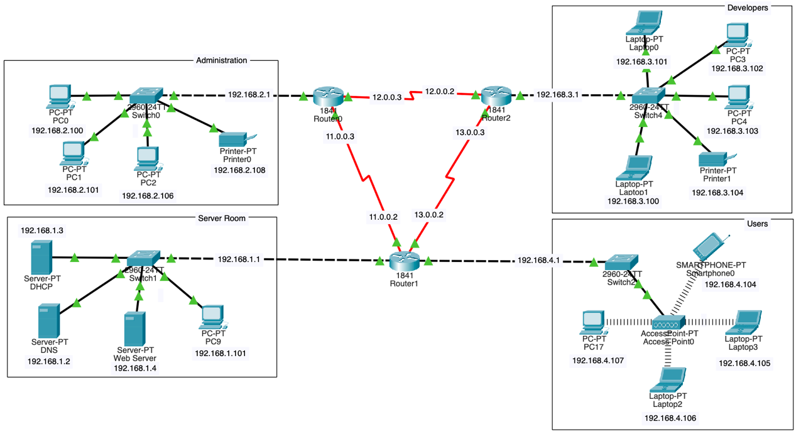
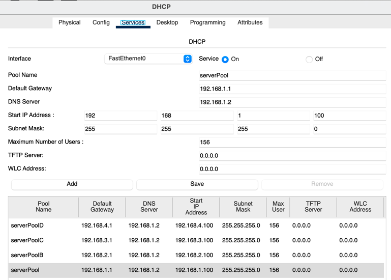
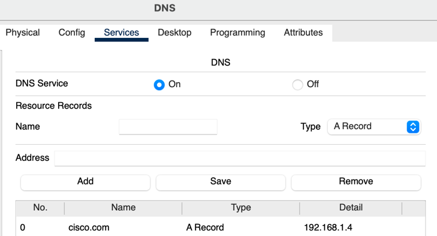
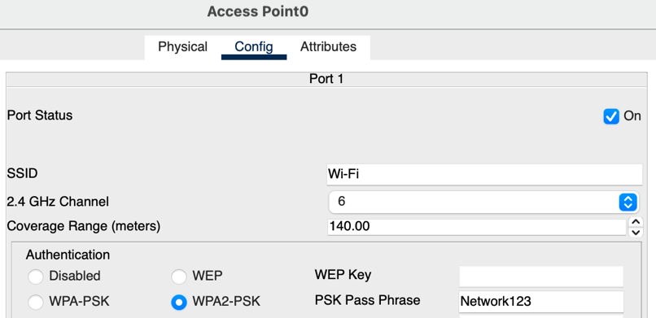
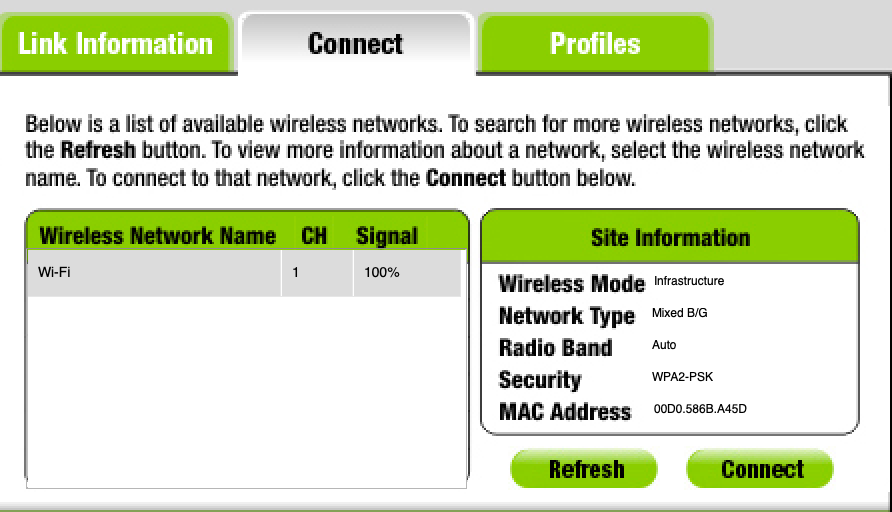

# Glovia — Enterprise Network Design (Cisco Packet Tracer)

A multi-department network for a fictional mid-sized company, Glovia, designed and simulated in Cisco Packet Tracer. It has three routers running RIP, four segmented departmental subnets, centralized DHCP/DNS/web services, and a WPA2-secured wireless network.

> Final project for **CS 2091 – Computer Networks**, Effat University (Spring 2025).
> Built by **Zainab Taha** and **Natali Soukh**.



---

## Highlights

- **3-router WAN core** (Cisco 1841) connected over serial links in a triangle, with **RIP** for dynamic route discovery and path redundancy
- **4 segmented departments**, each with its own subnet: Server Room, Administration, Development, and Wireless Users
- **Centralized DHCP** serving all four subnets from one server, using `ip helper-address` to relay DHCP requests across routers
- **Internal DNS** resolving `cisco.com` to the internal web server
- **Secure wireless** access point with WPA2-PSK serving laptops, a PC, and a smartphone
- **Shared network printers** in the Administration and Development departments

## Addressing Plan

| Segment | Subnet | Gateway | Devices |
|---|---|---|---|
| Server Room | 192.168.1.0/24 | 192.168.1.1 | DHCP (.3), DNS (.2), Web Server (.4), PC |
| Administration | 192.168.2.0/24 | 192.168.2.1 | 3 PCs, printer |
| Development | 192.168.3.0/24 | 192.168.3.1 | 2 PCs, 2 laptops, printer |
| Wireless Users | 192.168.4.0/24 | 192.168.4.1 | Access point, PC, 2 laptops, smartphone |
| Router0 ↔ Router1 | 11.0.0.0/8 | — | Serial link |
| Router0 ↔ Router2 | 12.0.0.0/8 | — | Serial link |
| Router1 ↔ Router2 | 13.0.0.0/8 | — | Serial link |

## How It Works

**Routing.** Each department connects through a Layer 2 switch (Cisco 2960) to a router. The three routers share routes with RIP, so every subnet can reach every other subnet without static routes.

**IP assignment.** One DHCP server in the Server Room holds a separate pool for each subnet (gateway, DNS server, start address, max users). Router interfaces facing the other departments forward DHCP broadcasts to it with `ip helper-address 192.168.1.3`.



**Name resolution.** The DNS server (192.168.1.2) maps `cisco.com` to the web server at 192.168.1.4, so users reach it by name.



**Wireless.** The Users segment has an access point with WPA2-PSK. Wireless clients use a WMP300N wireless module, scan for the SSID, authenticate, and then get an address from DHCP.

| Access point config | Client connecting |
|---|---|
|  |  |

## Repository Contents

```
├── packet-tracer/Glovia-Network.pkt      # Full Packet Tracer simulation
├── docs/Glovia-Network-Design-Report.pdf # Design report
└── images/                               # Topology and configuration screenshots
```

## Running the Simulation

1. Install [Cisco Packet Tracer](https://www.netacad.com/courses/packet-tracer) (free with a Cisco NetAcad account).
2. Open `packet-tracer/Glovia-Network.pkt`.
3. Try it out:
   - From any PC, open **Desktop → Command Prompt** and `ping` a device in another department (for example, `ping 192.168.1.4`).
   - Open **Desktop → Web Browser** and go to `cisco.com` to test DNS and the web server.
   - Run `ipconfig` on a client to see the address DHCP gave it.

## Skills Demonstrated

Network design · Subnetting / IPv4 addressing · RIP dynamic routing · DHCP and DHCP relay · DNS · Wireless security (WPA2) · Cisco IOS configuration · Cisco Packet Tracer · Technical documentation
